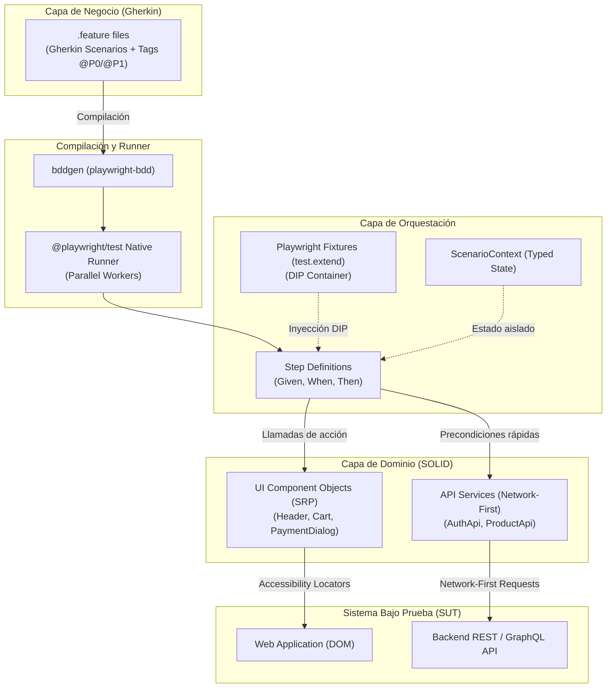
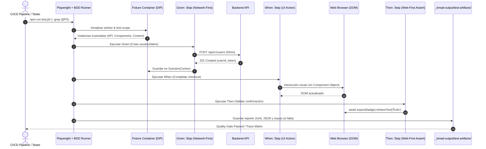

# Architecture Diagrams & Flow Models

## 1. Diagrama de Capas y Flujo de Dependencias (SOLID + BDD)

```mermaid
graph TD
    subgraph BusinessLayer["Capa de Negocio (Gherkin)"]
        FeatureFiles[".feature files<br/>(Gherkin Scenarios + Tags @P0/@P1)"]
    end

    subgraph CompilerLayer["Compilación y Runner"]
        BDDGen["bddgen (playwright-bdd)"]
        PlaywrightRunner["@playwright/test Native Runner<br/>(Parallel Workers)"]
    end

    subgraph OrchestrationLayer["Capa de Orquestación"]
        StepDefs["Step Definitions<br/>(Given, When, Then)"]
        Fixtures["Playwright Fixtures (test.extend)<br/>(DIP Container)"]
        ScenarioCtx["ScenarioContext (Typed State)"]
    end

    subgraph DomainLayer["Capa de Dominio (SOLID)"]
        Components["UI Component Objects (SRP)<br/>(Header, Cart, PaymentDialog)"]
        Services["API Services (Network-First)<br/>(AuthApi, ProductApi)"]
    end

    subgraph SUT["Sistema Bajo Prueba (SUT)"]
        WebUI["Web Application (DOM)"]
        BackendAPI["Backend REST / GraphQL API"]
    end

    FeatureFiles -->|Compilación| BDDGen
    BDDGen --> PlaywrightRunner
    PlaywrightRunner --> StepDefs
    Fixtures -.->|Inyección DIP| StepDefs
    ScenarioCtx -.->|Estado aislado| StepDefs
    StepDefs -->|Llamadas de acción| Components
    StepDefs -->|Precondiciones rápidas| Services
    Components -->|Accessibility Locators| WebUI
    Services -->|Network-First Requests| BackendAPI
```

## 2. Flujo de Ejecución por Escenario (Lifecycle & Quality Gate)

```mermaid
sequenceDiagram
    autonumber
    actor CI as CI/CD Pipeline / Tester
    participant Runner as Playwright + BDD Runner
    participant Fixture as Fixture Container (DIP)
    participant GivenStep as Given: Step (Network-First)
    participant API as Backend API
    participant WhenStep as When: Step (UI Action)
    participant UI as Web Browser (DOM)
    participant ThenStep as Then: Step (Web-First Assert)
    participant Artifacts as _bmad-output/test-artifacts/

    CI->>Runner: npm run test:p0 (--grep @P0)
    Runner->>Fixture: Inicializar worker & test scope
    Fixture-->>Runner: Instancias inyectadas (API, Components, Context)
    
    Runner->>GivenStep: Ejecutar Given (Crear usuario/datos)
    GivenStep->>API: POST /api/v1/users (50ms)
    API-->>GivenStep: 201 Created (userId, token)
    GivenStep->>Fixture: Guardar en ScenarioContext
    
    Runner->>WhenStep: Ejecutar When (Completar checkout)
    WhenStep->>UI: Interacción visual con Component Objects
    UI-->>WhenStep: DOM actualizado
    
    Runner->>ThenStep: Ejecutar Then (Validar confirmación)
    ThenStep->>UI: await expect(badge).toHaveText('Éxito')
    
    Runner->>Artifacts: Guardar reporte JUnit, JSON y trazas (si falla)
    Artifacts-->>CI: Quality Gate Passed / Trace Matrix
```
